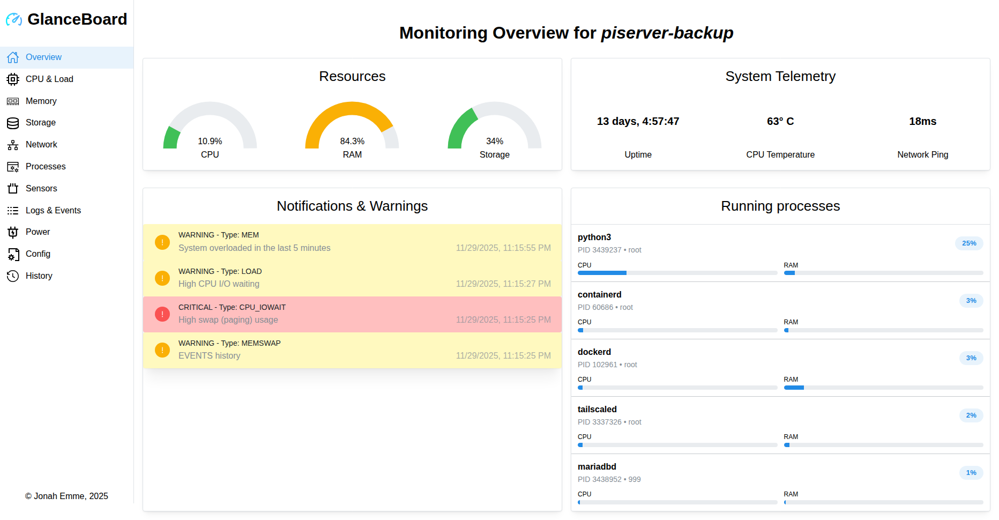

# Glance Board

A modern system monitoring dashboard to visualize server metrics from Glances.

GlanceBoard connects to a glance agent and presents real-time and historical system metrics with a clean, responsive UI built with TypeScript. It is designed to be lightweight, extendable, and easy to deploy (standalone or with Docker).

## Screenshots

